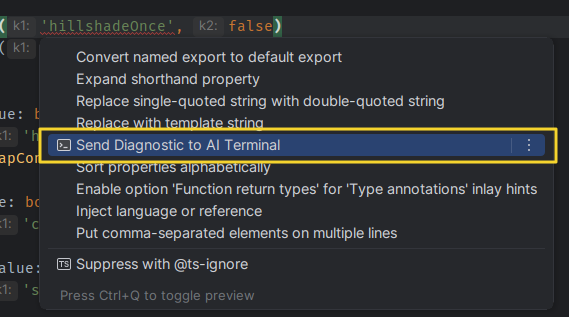
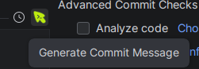
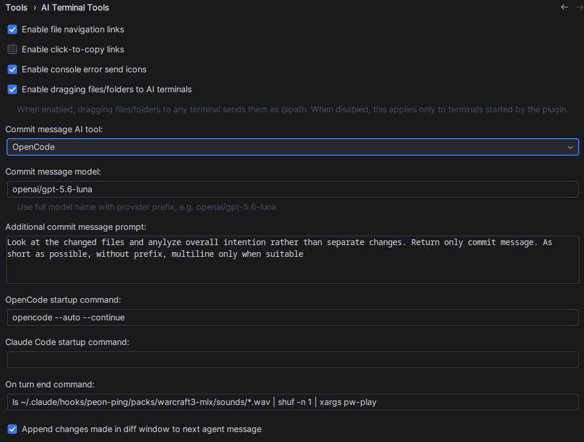

# OpenCode / Claude Code / Pi / Codex TUI integration

A JetBrains IDE plugin for terminal, console, and Commit panel workflows. Forked from [Q-110/ai-terminal-tools](https://github.com/Q-110/ai-terminal-tools) with enhancements and new functionality. 

## Promo

| Preview                    | Link                                                                                                                                                                                      |
|----------------------------|-------------------------------------------------------------------------------------------------------------------------------------------------------------------------------------------|
| Send to Terminal           | <a href="promo/send_to_terminal.png" target="_blank" rel="noopener noreferrer"></a>                            |
| Commit Message Generation  | <a href="promo/commit_message_generation.png" target="_blank" rel="noopener noreferrer"></a> |  
| Settings                   | <a href="promo/settings.png" target="_blank" rel="noopener noreferrer"></a>                                                    |
| Jump to Definition         | <a href="promo/jump_to_definition.mp4" target="_blank" rel="noopener noreferrer">Open jump_to_definition.mp4</a>                                                                          |
| Send Hint to Terminal      | <a href="promo/send_hint_to_terminal.mp4" target="_blank" rel="noopener noreferrer">Open send_hint_to_terminal.mp4</a>                                                                    |
| Append Reverted to Message | <a href="promo/append_reverted_to_message.mp4" target="_blank" rel="noopener noreferrer">Open append_reverted_to_message.mp4</a>                                                          |
| Send Selection to Terminal | <a href="promo/send_selection_to_terminal.mp4" target="_blank" rel="noopener noreferrer">Open send_selection_to_terminal.mp4</a>                                                          |


Requirements:

- JetBrains IDE 2025.1+
- At least one supported AI CLI installed: OpenCode (`opencode`), Claude Code (`claude`), Pi (`pi`), or Codex (`codex`) available on `PATH`
- JDK 17 and Gradle Wrapper for local development or plugin builds

Workflow:

1. Click "Start OpenCode", "Start Claude Code", "Start Pi", or "Start Codex" in the IDE toolbar.
2. The plugin reuses an existing terminal tab for the same tool if one is open, or creates a new tab. It injects the `AITT_*` environment and runs the selected CLI, then automatically activates the terminal.
3. Send selections from editors, consoles, diffs, or read-only viewers, or send file paths from the project view, editor tabs, or the Commit panel.
4. AI Turn Diff automatically tracks real file content changes in plugin-started OpenCode, Claude Code, Pi, and Codex terminals and opens a diff window when changes are detected.

> AI Turn Diff only auto-attaches to terminals started from the plugin buttons. Manually started terminals can still receive selection and path sends, but they will not get the turn-tracking integration.

## Features

### File Jump Links

Terminal and console output are parsed into clickable file links that jump to the matching file and line range in the IDE.

Supported formats:

```text
ExampleController.java
ExampleController.java:22
ExampleController.java:22-30
src/main/java/com/example/ExampleController.java:22
./src/main/java/com/example/ExampleController.java:22-30
../module/src/main/java/com/example/ExampleController.java:22
C:\Projects\demo\src\main\java\com\example\ExampleController.java:22
/projects/demo/src/main/java/com/example/ExampleController.java:22
@src/main/java/com/example/ExampleController.java:10
```

Resolution rules:

- Prefer suffix matching against project files.
- Recognizes any file extension of 2 to 12 characters.
- `@path` references have higher priority for AI terminal path matching.
- When multiple files match, IntelliJ project index scoring is used; if there are still multiple candidates, a chooser dialog is shown.

### AI Terminal Sending

Send editor selections, file paths, or console errors into the active terminal input area. The target terminal can be OpenCode, Claude Code, Pi, or Codex.

- Shortcut: `Ctrl+Alt+,`
- Context menus:
  - Editor context menu -> Send Selection to AI Terminal
  - Console / Run output -> Send Selection to AI Terminal
  - Diff view -> Send Selection to AI Terminal
  - Read-only text viewer -> Send Selection to AI Terminal
- Send format:

```text
@src/main/java/A.java:10-20
-------
<selected code>
-------
```

When there is no linked file, only plain text is sent.

File and folder paths are sent as `@displayPath`. Dragging multiple files or folders merges them into a single line and keeps a trailing space to end completion.

### Console Error Sending

Run/Debug Console error and exception headers can show a send icon that sends the visible error block to the active terminal.

Supported sources include JVM, Python, JavaScript/Node.js, TypeScript, Go, Rust, Ruby, and GCC/Clang C/C++ diagnostics.

### AI Turn Diff

When OpenCode, Claude Code, Pi, or Codex is started through the plugin, the plugin tracks each AI turn's file modifications and opens a diff when the content actually changes.

- The before-side of the diff is read-only; the after-side shows the current file state.
- OpenCode: generates a project-level `.opencode/plugins/ai-terminal-tools.js` and a per-terminal launcher.
- Claude Code: generates `.claude/settings.local.json` hooks and a per-terminal launcher.
- Pi: generates a project-level `.pi/extensions/ai-terminal-tools.ts` extension and a per-terminal launcher.
- Codex: generates a per-terminal launcher that passes a `notify` configuration override. Its completion callback compares a project-file snapshot because Codex notifications do not identify individual file writes.
- Diff state is isolated by `tabId` and upstream session ID.
- You can reopen the last diff from Tools -> OpenCode / Claude Code / Pi / Codex TUI integration -> Show Last AI Turn Diff.

### Terminal Tab Reuse

Clicking a start action when a terminal for that tool already exists activates and focuses the existing tab instead of creating a new one.

## Settings

Available settings:

- Enable console error send icon
- Enable drag-and-drop files/folders to AI Terminal
- Commit message AI tool (OpenCode, Claude Code, Pi, or Codex)
- Commit message model (full model name with provider prefix)
- Commit message additional prompt
- On turn end command (shell command run after each AI turn completes)
- Append diff changes to next agent message

## Build and Run

Requirements:

- JetBrains IDE 2025.1+ or a custom `-P` target platform
- JDK 17
- Gradle Wrapper

Common commands:

```powershell
./gradlew.bat runIde
./gradlew.bat buildPlugin "-PplatformVersion=2025.1" "-PplatformType=IU"
./gradlew.bat runIde "-PplatformVersion=2025.3" "-PplatformType=IU"
./gradlew.bat buildPlugin
```

## Developer Docs

See [docs/ARCHITECTURE.md](docs/ARCHITECTURE.md) for the project structure and AI CLI integration details.

## Plugin Info

| Item | Value |
|------|-------|
| Plugin ID | `io.github.forstjiri.aiterminaltool` |
| Version | `0.5.6` |
| Group | `io.github.forstjiri` |
| Vendor | `forstjiri` |
| License | MIT |
